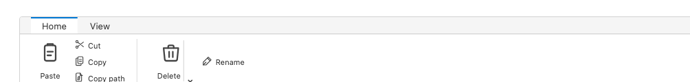
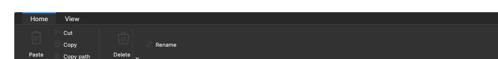
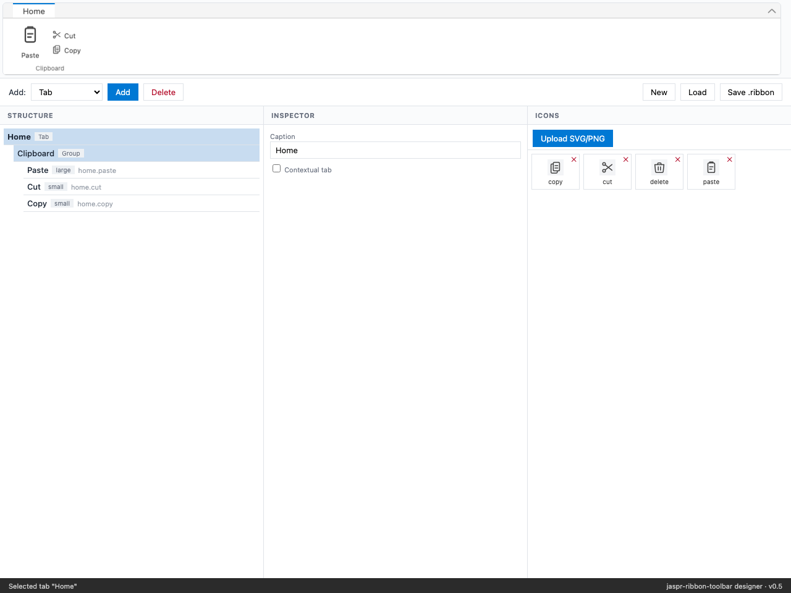

# jaspr-ribbon-toolbar

[](https://pub.dev/packages/jaspr_ribbon_toolbar)
[](Makefile)
[](https://dart.dev)
[](https://jaspr.site)
[](LICENSE)
[](https://github.com/jedt3d/jaspr-ribbon-toolbar/releases/tag/v0.5.0)

An **MS Office–style ribbon toolbar** component for [Jaspr](https://jaspr.site/)
web apps, rendered to an HTML5 `<canvas>`. It is a **direct port** of the Xojo
[`XjRibbon`](https://github.com/jedt3d/XjRibbon) library — every control type,
the colour system, and the `.ribbon` JSON schema trace back to the original.



---

## Features

- **All seven control kinds** from the Windows File Explorer reference:
  large / small / dropdown / splitbutton / toggle / checkbox / separator.
- **Tab-based navigation** with hover states and **contextual tabs** (show/hide
  by context group, with accent wash).
- **Collapse/expand** via chevron or double-click.
- **Dark mode** — a runtime-toggleable port of Xojo's `ResolveColors` palette.



- **SVG/PNG icons** by string key (`IconRegistry`) — the Xojo icon pain point,
  solved.
- **Canvas-rendered dropdown menus** — anchored below the button, viewport-aware.
- **HiDPI** backing-store scaling for crisp rendering on retina.
- **Pure-Dart data model** — reusable by the renderer, the designer, and the LSP
  server; serialisable to self-contained `.ribbon` JSON bundles (icons embedded).
- **Sealed event API** — exhaustive `switch` over `RibbonEvent`.

## Quick start

```yaml
# pubspec.yaml
dependencies:
  jaspr: ^0.23.1
  jaspr_ribbon_toolbar:
    path: ../jaspr_ribbon_toolbar   # or the unpacked release archive
```

```dart
import 'package:jaspr_ribbon_toolbar/jaspr_ribbon_toolbar.dart';

final ribbon = RibbonDefinition(
  tabs: [
    RibbonTab(caption: 'Home', groups: [
      RibbonGroup(caption: 'Clipboard', items: [
        RibbonItem.large(caption: 'Paste', tag: 'clipboard.paste', iconKey: 'paste'),
        RibbonItem.small(caption: 'Cut', tag: 'clipboard.cut', iconKey: 'cut'),
      ]),
    ]),
  ],
);
```

Render the `<canvas>` component, then drive it with the controller:

```dart
// In your *.client.dart:
RibbonCanvasController(
  canvas: document.getElementById('ribbon') as HTMLCanvasElement,
  definition: ribbon,
  colors: RibbonColors.light,
  onEvent: (event) {
    switch (event) {
      case ItemPressedEvent(:final tag):              handleCommand(tag);
      case DropdownMenuActionEvent(:final menuItemTag): handleCommand(menuItemTag);
      case CollapseStateChangedEvent():               /* … */
      case TabChangedEvent():                         /* … */
    }
  },
).attach();
```

📖 **Full tutorial** (3 guides + 3 runnable apps) in [`tutorial/`](tutorial/).

## Visual designer

A standalone Jaspr app for building ribbons visually — no code required. Upload
SVG/PNG icons, edit structure, assign tags, and save a self-contained `.ribbon`
bundle.



```bash
cd apps/jaspr_ribbon_designer && jaspr serve
```

Or download the **prebuilt** from the
[latest release](https://github.com/jedt3d/jaspr-ribbon-toolbar/releases/tag/v0.5.0)
— unzip and serve with any static server.

## Repository layout

| Path | What |
|------|------|
| `packages/jaspr_ribbon_toolbar` | the reusable component (model + canvas renderer + controller) |
| `packages/jaspr_ribbon_lsp` | the `.ribbon` language server (validation / autocomplete / hover) |
| `apps/jaspr_ribbon_example` | a live, interactive demo with real SVG icons |
| `apps/jaspr_ribbon_designer` | the standalone visual designer |
| `tutorial/` | 3-part tutorial with 3 runnable apps |
| `editors/vscode/` | VS Code extension scaffold for the LSP |

## Developing

```bash
make pub-get      # resolve dependencies
make verify       # CI gate: format + analyze + test (223 assertions)
make lint-ribbon FILE=examples/explorer.ribbon   # validate a .ribbon bundle
make docs         # generate API reference → api/
```

Read **[`AGENTS.md`](AGENTS.md)** for architecture, conventions, and porting
notes. See [`retrospective.md`](retrospective.md) and
[`PLAN-as-it-should-be.md`](PLAN-as-it-should-be.md) for the project history.

## Acknowledgements

Ported from [XjRibbon](https://github.com/jedt3d/XjRibbon) by Worajedt
Sitthidumrong. Built on [Jaspr](https://jaspr.site/) by Kilian Schulte.

## License

MIT — see [LICENSE](LICENSE).
